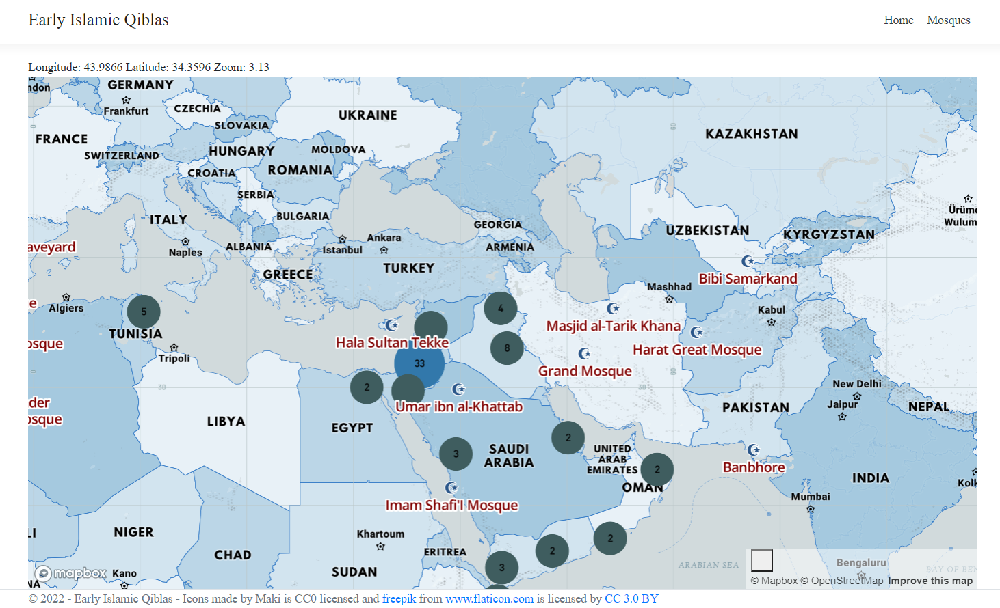
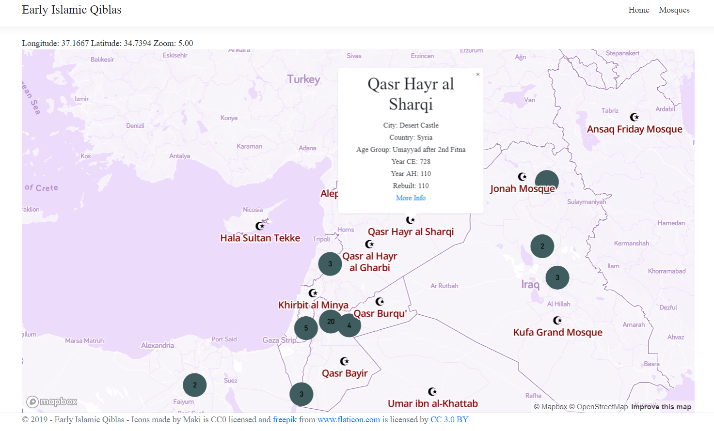

# Early Islamic Qiblas

A web application for visualizing early Islamic qibla (prayer direction) data with interactive maps and tabular views. Built with ASP.NET Core (.NET 10.0) backend and React 16.x frontend.

## Quick Start

### Prerequisites

- **Node.js & npm** — For React frontend
- **.NET 10.0 SDK** — For ASP.NET Core backend  
- **Mapbox Account** — For map rendering (token required)

### Installation & Running

1. **Configure Mapbox**
   ```bash
   # Create ClientApp/.env with your Mapbox token
   REACT_APP_MAPBOX_ACCESS_TOKEN=pk_your_token_here
   REACT_APP_MAPBOX_STYLE=mapbox://styles/mapbox/streets-v12
   ```

2. **Install & Run**
   ```bash
   dotnet restore
   cd ClientApp && npm install && cd ..
   dotnet run
   ```

   - Backend: `https://localhost:5001`
   - Frontend: `http://localhost:3000` (development only)

3. **Production Build**
   ```bash
   # Build React bundle
   cd ClientApp && npm run build && cd ..
   
   # Run ASP.NET Core (serves ClientApp/build)
   dotnet run --configuration Release
   ```

## Architecture

**Two-project solution:**

| Project | Target | Purpose |
|---------|--------|---------|
| `EarlyIslamicQiblas.Core` | netstandard2.1 | Domain models, repository interface, services, geographic extensions |
| `early-islamic-qiblas` | net10.0 | ASP.NET Core web host, controllers, EF Core InMemory DB, React SPA |

**Key Features:**

- **No external database** — Loads all data from `Data/mosques` JSON at startup (InMemory EF Core)
- **No AutoMapper** — Manual mapping in `FeatureService` (minimal overhead)
- **Portable Core** — netstandard2.1 allows framework upgrades without breaking domain layer
- **GeoJSON API** — REST endpoints return standard GeoJSON for map integration
- **Geographic Math** — 3D centroid calculation for point cloud analysis

## API Endpoints

All endpoints are `GET` (read-only, immutable dataset):

| Endpoint | Purpose |
|----------|---------|
| `/api/v1/mosque/list` | All mosques |
| `/api/v1/mosque/pagedlist?page=N&pageSize=N&sorted=JSON` | Paginated & sortable |
| `/api/v1/mosque/{name}` | Single mosque by name |
| `/api/v1/marker/list` | GeoJSON FeatureCollection (all mosques for map) |
| `/api/v1/marker/centroid` | Geographic centroid of all locations |
| `/api/v1/marker/random` | Random mosque coordinates |

See **[Technical Analysis](docs/technical-analysis.md#api-reference)** for full API reference and examples.

## QGIS Plugin

A standalone Python plugin for QGIS that allows for direct visualization and analysis of the mosque dataset without requiring the .NET backend to be running.

### Key Features

- **Standalone Operation** — Uses local `mosques.json` (embedded in assets).
- **Custom Symbology** — Automatically applies mosque-specific icons to the markers.
- **Interactive Popups** — Uses QGIS Map Tips to display detailed mosque metadata on hover.
- **3D Centroid Calculation** — Ported C# geographic math for local centroid analysis in QGIS.
- **External Actions** — Right-click context menu actions to open ArchNet/academic links in the browser.

### Installation

1. Navigate to the `qgis_plugin_distr/` folder.
2. Locate the latest ZIP file (e.g., `early_islamic_qiblas_v0.2.4.zip`).
3. In QGIS, go to **Plugins > Manage and Install Plugins**.
4. Select **Install from ZIP** and choose the ZIP file.

### How to Use

1. **Launch**: Click the mosque icon in the toolbar or go to **Plugins > Early Islamic Qiblas**.
2. **Load Data**: Click **Load Mosques** to create a new vector layer with the full dataset.
3. **View Info**: 
   - Enable **View > Map Tips** to see mosque details when hovering over points.
   - Right-click a mosque and select **Actions > Open More Info** to open external research links.
4. **Analyze**: Click **Calculate Centroid** to generate a local point representing the 3D geographic center of all mosques.

## Project Structure

```
├── EarlyIslamicQiblas.Core/           # Core library (netstandard2.1)
│   └── Models/
│       ├── Domain/                    # Mosque, MapBox entities, IMosqueRepository
│       ├── Service/                   # IFeatureService, FeatureService
│       ├── Extensions/                # GeoExtensions, CustomExtension
│       └── Configuration/             # StringConverter
├── early-islamic-qiblas/              # Web project (net10.0)
│   ├── Controllers/                   # MosqueController, MarkerController
│   ├── Models/
│   │   ├── Domain/                    # MosqueRepository implementation
│   │   ├── Infrastructure/            # DataLoader, MosqueDbContext, DI
│   │   └── Configuration/
│   ├── Data/                          # mosques JSON file
│   └── Program.cs                     # App host
├── ClientApp/                         # React 16.x SPA
│   ├── src/
│   │   ├── components/
│   │   ├── assets/
│   │   └── helpers/
│   └── .env                           # Mapbox credentials
├── qgis_plugin/                       # QGIS Plugin Source
│   ├── assets/                        # Icons and local mosques.json
│   ├── metadata.txt                   # Plugin metadata (v0.2.4)
│   └── early_islamic_qiblas_plugin.py # Python standalone logic
├── qgis_plugin_distr/                 # Distribution ZIP files
└── docs/                              # Documentation
    ├── technical-analysis.md          # Architecture, API, config, deployment
    └── functional-analysis.md         # Domain concepts, business rules, data semantics
```


## Documentation

- **[Technical Analysis](docs/technical-analysis.md)** — Architecture, system components, data flows, API reference, configuration, deployment notes.
- **[Functional Analysis](docs/functional-analysis.md)** — Domain concepts (Mosque, Qibla, Gibson Classification), business rules, GeoJSON mapping, data format examples.

## Technology Stack

### Backend
- **ASP.NET Core** net10.0
- **Entity Framework Core** — InMemory database
- **System.Text.Json** — JSON serialization (no external dependencies)
- **CORS** — Enabled for all origins (development)

### Frontend
- **React** 16.x
- **Mapbox GL JS** 2.6.1+
- **React Table** 6.10.0+ — Paginated data grid
- **Bootstrap 4 + Reactstrap** — UI components
- **React Router** — Client-side navigation

## Features

- ✓ Interactive map with mosque location markers
- ✓ Paginated & sortable data table
- ✓ Geographic centroid calculation (3D vector math)
- ✓ Responsive design (mobile-friendly)
- ✓ GeoJSON export (compatible with ArcGIS, QGIS)
- ✓ Historical timeline (Muhammad through Late Islamic periods)
- ✓ External reference links (ArchNet, academic sources)

## Data Model

Each mosque record contains:

| Field | Type | Example |
|-------|------|---------|
| `mosqueName` | string | "Quba Mosque" |
| `city` | string | "Medina" |
| `country` | string | "Saudi Arabia" |
| `yearCE` | string | "622" |
| `yearAH` | string | "1" |
| `ageGroup` | string | "Muhammad" |
| `lat`, `lon` | double | 24.439619, 39.617228 |
| `dir` | double? | 328 (qibla angle in degrees) |
| `gibsonClassification` | string | "Unknown", "Type A", etc. |
| `rebuilt` | string? | "435 AH" |
| `moreInfo` | string? | "http://archnet.org/sites/548" |

See **[Functional Analysis](docs/functional-analysis.md)** for complete domain documentation.

## Development

### Backend
```bash
dotnet run                          # Debug mode
dotnet run --configuration Release  # Optimized
```

### Frontend (React dev server)
```bash
cd ClientApp
npm start
```

Proxies API calls to backend. Hot reload on file changes.

### Adding New Endpoints

1. Create method in `MosqueController` or `MarkerController`
2. Decorate with `[HttpGet]` and `[EnableCors("qiblas")]`
3. Inject `IMosqueRepository` or `IFeatureService` via constructor
4. Return result (JSON serialized automatically)

Example:
```csharp
[HttpGet("[action]")]
[EnableCors("qiblas")]
public async Task<IEnumerable<string>> GetCities()
{
    var mosques = await repoMosque.Get();
    return mosques.Select(m => m.City).Distinct();
}
```

## Deployment

### Docker

Multi-stage build serving React + ASP.NET Core from single container:

```bash
docker build -t early-islamic-qiblas .
docker run -p 8080:8080 early-islamic-qiblas
```

See [Technical Analysis](docs/technical-analysis.md#deployment--infrastructure) for Dockerfile template.

### Environment Variables (Production)

| Variable | Example |
|----------|---------|
| `ASPNETCORE_URLS` | `http://+:80` |
| `ASPNETCORE_ENVIRONMENT` | `Production` |

## Performance

- **In-Memory Database** — Entire dataset (~500 mosques) loaded at startup for instant queries
- **Geographic Math** — Centroid calculation runs in O(n) with 3D vector operations
- **Pagination** — Client-side (server returns full dataset); optimize with DB-layer pagination for scale

For large datasets (>1M records), replace `UseInMemoryDatabase()` with SQL Server or PostgreSQL.

## CORS Policy

**Current (Development):** Allows all origins, headers, methods.

**For Production:** Restrict to specific domain in `NativeInjectorBootStrapper.cs`:
```csharp
o.WithOrigins("https://yourdomain.com")
 .AllowAnyHeader()
 .AllowAnyMethod();
```

## License

See LICENSE file.

## Contact & Attribution

Built with historical mosque data from academic sources (e.g., ArchNet, Creswell, al-Tabari).


