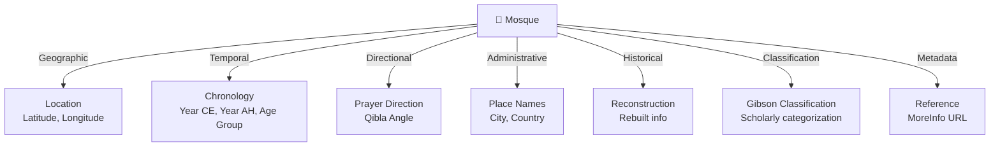
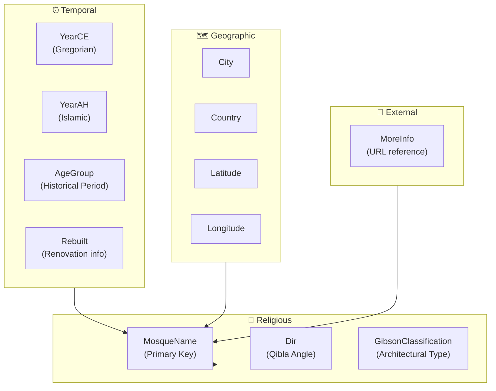
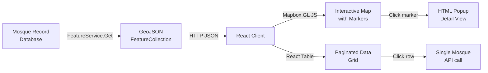

# Functional Analysis: Early Islamic Qiblas

Comprehensive domain documentation for the Early Islamic Qiblas application, defining business concepts, data semantics, and functional requirements.

## Table of Contents

1. [Domain Overview](#domain-overview)
2. [Core Concepts](#core-concepts)
3. [Data Model & Semantics](#data-model--semantics)
4. [GeoJSON Mapping](#geojson-mapping)
5. [Business Rules](#business-rules)
6. [Data Format & Examples](#data-format--examples)

---

## Domain Overview

The Early Islamic Qiblas application provides scholars and researchers with a comprehensive dataset and visualization tools for studying the geographic distribution of early Islamic prayer directions (qiblas). The system maps historical mosque locations to their computed or documented prayer direction angles, contextualizing them within Islamic history periods and geographic/administrative boundaries.

### Primary Use Cases

| Use Case | Actor | Goal |
|----------|-------|------|
| **Explore Map** | Researcher | View geographic distribution of mosques on interactive map with popup details |
| **Filter & Sort Data** | Researcher | Refine mosque list by location, time period, classification; sort by name, country, year |
| **View Details** | Researcher | Access single mosque record with full attributes and external reference links |
| **Calculate Centroid** | Analyst | Determine geographic center of all mosque locations for regional analysis |
| **Export Data** | Researcher | Retrieve structured GeoJSON for import into GIS tools |

---

## Core Concepts

### 1. **Mosque**

A **Mosque** represents a single place of Islamic worship, documented in the Early Islamic Qibla dataset. Each mosque is uniquely identified by its name and contains geographic, temporal, and directional information.



**Attributes:**

| Attribute | Type | Meaning |
|-----------|------|---------|
| `MosqueName` | string | Unique identifier; historical name of mosque |
| `City` | string | City or town location |
| `Country` | string | Modern nation-state (for geographic reference) |
| `YearCE` | string | Construction/founding date in Common Era (Gregorian) |
| `YearAH` | string | Construction/founding date in Islamic calendar (Hijri) |
| `AgeGroup` | string | Scholarly historical period (e.g., "Muhammad", "Umayyad", "Abbasid") |
| `Rebuilt` | string | If reconstructed/renovated, when and how (e.g., "435 AH") |
| `Lat` | double | Decimal latitude of mosque location (WGS84) |
| `Lon` | double | Decimal longitude of mosque location (WGS84) |
| `Dir` | double (nullable) | Qibla angle in degrees (0°=North, 90°=East, clockwise) |
| `GibsonClassification` | string | Scholarly classification scheme (e.g., "Type A", "Unknown") |
| `MoreInfo` | string (nullable) | URL to external reference (e.g., ArchNet database) |

### 2. **Qibla**

**Qibla** is the direction toward the Kaaba in Mecca toward which Muslims perform prayer. The application captures qibla direction as:

- **Angle in degrees:** 0° = North, 90° = East, 180° = South, 270° = West, clockwise
- **Computed or documented:** Some values are calculated from geographic coordinates; others from historical sources
- **Null if unknown:** Field is optional (`Dir?`)

**Historic Significance:**
Early Muslims determined qibla direction through various methods:
1. **Geographic calculation** — Based on mosque location relative to Mecca
2. **Compass observation** — Direct measurement
3. **Scholarly tradition** — Recorded in historical texts
4. **Astronomical observation** — Precision methods developed over time

The dataset captures these variations, making it valuable for studying the evolution of Islamic geographic practices.

### 3. **Age Group / Historical Period**

**Age Group** categorizes mosques into scholarly-defined historical periods of Islamic history:

| Period | Era | Approximate Duration | Context |
|--------|-----|----------------------|---------|
| **Muhammad** | 609–632 CE / 1–11 AH | 23 years | Prophet Muhammad's lifetime; only 2 major mosques |
| **Rightly Guided** | 632–661 CE / 11–40 AH | 29 years | First four Caliphs; rapid expansion |
| **Umayyad** | 661–750 CE / 40–132 AH | 89 years | First Islamic dynasty; vast territorial expansion |
| **Abbasid (Early)** | 750–900 CE / 132–285 AH | 150 years | Golden Age; architectural innovation |
| **Later Islamic** | 900 CE+ / 285 AH+ | Ongoing | Medieval & post-Medieval periods |

**Function:** Enables temporal filtering and historical comparison of qibla practices across epochs.

### 4. **Gibson Classification**

**Gibson Classification** is a scholarly system for categorizing early Islamic architecture and religious practices. The system developed by Creswell and others categorizes mosques by:

- **Architectural style** — Column arrangement, courtyard design
- **Religious function** — Primary mosque (jami), subsidiary (musalla), private
- **Geographic origin** — Levantine, Arabian, Egyptian, Persian influences
- **Typological innovation** — Early innovations vs. inherited Byzantinian/Sassanid forms

**Values in Dataset:**

| Classification | Meaning |
|----------------|---------|
| `Type A` | Hypostyle mosque with open courtyard (most common) |
| `Type B` | Basilical plan with longitudinal nave |
| `Type C` | Centralized/cruciform design |
| `Unknown` | Insufficient documentation or debated attribution |
| `Contemporary` | Modern reconstruction/documentation issues |

**Importance:** Reveals patterns in Islamic religious architecture and how communities adapted existing Byzantine/Persian building traditions to Islamic needs.

### 5. **Temporal Representation: YearCE & YearAH**

Mosques are dated in **two calendars simultaneously**:

**YearCE (Common Era / Gregorian):**
- Absolute dating system used globally
- Allows correlation with non-Islamic historical events
- Example: `622` = founding of Medina (Islamic calendar Year 1)

**YearAH (Anno Hegirae / Islamic Calendar):**
- Lunar calendar, slightly shorter than solar year (~354 days)
- Counts years from the Hijra (622 CE)
- Example: `1` = 622 CE

**Conversion Formula:**
```
YearCE = 622 + (YearAH × 354.36) / 365.25  (approximate)
```

**Function:** Dual dating allows researchers working in Islamic sources (which use AH) or Western scholarship (which uses CE) to locate records in both systems simultaneously.

### 6. **Geographic Coordinates**

Mosques are geolocated using the **WGS84 coordinate system** (World Geodetic System 1984):

- **Latitude (`Lat`)** — Position north (+) or south (−) of the equator, range [−90, +90]°
- **Longitude (`Lon`)** — Position east (+) or west (−) of Prime Meridian, range [−180, +180]°
- **Format:** Decimal degrees (e.g., `24.439619` = 24° 26' 22.6" N)

**Accuracy:** Most dataset entries record location to 0.01° precision (~1 km), derived from:
- Modern satellite imagery
- Historical city records
- Archaeological surveys

**Why WGS84?** Industry standard for mapping (Mapbox, Google Maps, OSM all use WGS84), enabling seamless integration with modern geospatial tools.

---

## Data Model & Semantics

### Complete Data Structure



### Key Invariants & Rules

| Rule | Enforcement | Rationale |
|------|-------------|-----------|
| `MosqueName` is unique | Primary key in database | Each mosque appears once in dataset |
| `Lat` ∈ [−90, 90] | Implicit (decimal validation) | Valid geographic latitude |
| `Lon` ∈ [−180, 180] | Implicit (decimal validation) | Valid geographic longitude |
| `Dir` ∈ [0, 360) or null | Documented | Qibla angle or unknown |
| `YearCE` ≈ `YearAH` | Conversion ratio 354.36/365.25 | Gregorian-Hijri synchronization |
| `Rebuilt` → `YearCE` ≠ original | Data integrity check | Reconstruction implies later date |
| `MoreInfo` = HTTP URL or null | Implicit | External reference is optional, valid URL when present |

---

## GeoJSON Mapping

### Why GeoJSON?

**GeoJSON** is a standard (RFC 7946) for encoding geographic data structures using JSON. The application uses GeoJSON to:

1. **Standardize data exchange** — Compatible with all mapping libraries (Mapbox, Leaflet, OpenLayers)
2. **Enable client-side rendering** — Browser can render features directly without server computation
3. **Support filtering/styling** — Mapbox GL JS styles features based on properties
4. **Enable data portability** — Researchers can export and import GeoJSON into ArcGIS, QGIS, etc.

### GeoJSON Structure: Mosque → Feature

Each mosque is converted into a GeoJSON **Feature** with the following semantics:

```json
{
  "type": "Feature",
  "geometry": {
    "type": "Point",
    "coordinates": [39.617228, 24.439619]
  },
  "properties": {
    "title": "Quba Mosque",
    "description": "<h3>Quba Mosque</h3>City: Medina<br/>Country: Saudi Arabia<br/>..."
  }
}
```

**Mapping Logic:**

| Mosque Field | GeoJSON Path | Transformation |
|--------------|--------------|-----------------|
| `Lon` | `geometry.coordinates[0]` | Direct copy |
| `Lat` | `geometry.coordinates[1]` | Direct copy (Note: GeoJSON order is [lon, lat], not [lat, lon]) |
| `MosqueName` | `properties.title` | Direct copy |
| All attributes | `properties.description` | HTML string via `PopUp()` method |

### FeatureCollection: All Mosques

The API endpoint `/api/v1/marker/list` returns all mosques as a **FeatureCollection**:

```json
{
  "type": "FeatureCollection",
  "features": [
    { "type": "Feature", "geometry": {...}, "properties": {...} },
    { "type": "Feature", "geometry": {...}, "properties": {...} }
  ]
}
```

### HTML Popup Content

The `PopUp()` method generates an HTML string for map popups:

```html
<h3>Quba Mosque</h3>
City: Medina<br/>
Country: Saudi Arabia<br/>
Age Group: Muhammad<br/>
Year CE: 622<br/>
Year AH: 1<br/>
Rebuilt: 1<br/>
<a href='http://archnet.org/sites/548' title='More Info' target='_blank'>More Info</a>
```

**Logic:**
- Links are included if `MoreInfo` does NOT contain `#` (fragment identifier)
- Fragment identifiers (`#`) are used for internal anchor links, which are non-functional in popups

---

## Business Rules

### Data Acquisition & Quality

| Rule | Description |
|------|-------------|
| **Single Source of Truth** | All mosque records come from `Data/mosques` JSON file; no dynamic data entry |
| **Historical Record** | Dates reflect founding, not modern reconstruction (unless `Rebuilt` field explicitly notes changes) |
| **Geographic Accuracy** | Coordinates sourced from modern satellite data, adjusted for known historical site locations |
| **Attribution** | Each mosque may have a `MoreInfo` link to academic sources (e.g., ArchNet) |
| **Null Handling** | Missing attributes (e.g., `Dir`, `GibsonClassification`) are nullable; omitted in JSON output |

### Temporal Consistency

| Rule | Description |
|------|-------------|
| **YearCE → YearAH Alignment** | Both dates should refer to same historical event; minor rounding acceptable (±1–2 years due to calendar differences) |
| **Age Group Assignment** | Must align with YearCE; automated validation possible (e.g., "Muhammad" age group requires YearCE ∈ [609, 632]) |
| **Rebuilt Later Than Original** | If `Rebuilt` is populated, its date must be later than original `YearCE` |

### Geographic Semantics

| Rule | Description |
|------|-------------|
| **WGS84 Standard** | All coordinates in decimal degrees (±180° lon, ±90° lat) |
| **Location Precision** | Accurate to city/town level; not precise to the building's exact foundation |
| **Country is Modern** | Country name is modern nation-state for geographic context; historical country may differ |
| **Centroid Calculation** | 3D vector average (great-circle distance), not simple 2D average (lat/lon) |

### API Behavior

| Rule | Description |
|------|-------------|
| **Immutable Data** | GET operations only; no POST/PUT/DELETE endpoints (static dataset) |
| **Stateless Queries** | Each API request is independent; no session state |
| **CORS Permissive** | All endpoints allow cross-origin calls (development setting; restrict in production) |
| **No Pagination Filter** | `filtered` parameter in PagedList is parsed but not applied (reserved for future) |
| **Soft Returns** | Get-by-name returns empty/null if not found, not HTTP 404 |

---

## Data Format & Examples

### JSON Record Format

**Complete Mosque Record:**

```json
{
  "gibsonClassification": "Unknown",
  "yearCE": "622",
  "yearAH": "1",
  "ageGroup": "Muhammad",
  "city": "Medina",
  "country": "Saudi Arabia",
  "mosqueName": "Quba Mosque",
  "rebuilt": "435 AH",
  "lat": 24.439619,
  "lon": 39.617228,
  "dir": 328,
  "moreInfo": "http://archnet.org/sites/548"
}
```

**Sparse Record (Many Optional Fields):**

```json
{
  "gibsonClassification": null,
  "yearCE": "750",
  "yearAH": "130",
  "ageGroup": "Umayyad",
  "city": "Damascus",
  "country": "Syria",
  "mosqueName": "Great Mosque of the Umayyads",
  "rebuilt": null,
  "lat": 33.513807,
  "lon": 36.276528,
  "dir": null,
  "moreInfo": null
}
```

### Type Conversions & Edge Cases

**Numeric Strings Handling:**

The JSON file may contain numbers instead of strings (e.g., `"yearCE": 622` instead of `"yearCE": "622"`). The `StringConverter` class handles this during deserialization:

```csharp
// Input JSON
{ "yearCE": 622 }

// StringConverter.Read()
if (reader.TokenType == JsonTokenType.Number)
{
    return reader.GetInt32().ToString();  // Convert to string
}

// Result
Mosque.YearCE = "622"
```

**Why?** The domain model uses strings for all date/classification fields to preserve original formatting from historical sources (e.g., "435 AH" with unit suffix).

### API Response Examples

**GET /api/v1/mosque/list**

```json
[
  {
    "gibsonClassification": "Unknown",
    "yearCE": "622",
    "yearAH": "1",
    "ageGroup": "Muhammad",
    "city": "Medina",
    "country": "Saudi Arabia",
    "mosqueName": "Quba Mosque",
    "rebuilt": "435 AH",
    "lat": 24.439619,
    "lon": 39.617228,
    "dir": 328.0,
    "moreInfo": "http://archnet.org/sites/548"
  },
  {
    "gibsonClassification": "Type A",
    "yearCE": "705",
    "yearAH": "86",
    "ageGroup": "Umayyad",
    "city": "Damascus",
    "country": "Syria",
    "mosqueName": "Great Mosque of the Umayyads",
    "rebuilt": null,
    "lat": 33.513807,
    "lon": 36.276528,
    "dir": null,
    "moreInfo": "http://archnet.org/sites/1"
  }
]
```

**GET /api/v1/mosque/pagedlist?page=0&pageSize=2&sorted=[{"id":"country","desc":false}]**

```json
{
  "rows": [
    {
      "gibsonClassification": "Unknown",
      "yearCE": "622",
      "yearAH": "1",
      "ageGroup": "Muhammad",
      "city": "Medina",
      "country": "Saudi Arabia",
      "mosqueName": "Quba Mosque",
      "rebuilt": "435 AH",
      "lat": 24.439619,
      "lon": 39.617228,
      "dir": 328.0,
      "moreInfo": "http://archnet.org/sites/548"
    }
  ],
  "pages": 45
}
```

**GET /api/v1/marker/list**

```json
{
  "type": "FeatureCollection",
  "features": [
    {
      "type": "Feature",
      "geometry": {
        "type": "Point",
        "coordinates": [39.617228, 24.439619]
      },
      "properties": {
        "title": "Quba Mosque",
        "description": "<h3>Quba Mosque</h3>City: Medina<br/>Country: Saudi Arabia<br/>Age Group: Muhammad<br/>Year CE: 622<br/>Year AH: 1<br/>Rebuilt: 435 AH<br/><a href='http://archnet.org/sites/548' title='More Info' target='_blank'>More Info</a>"
      }
    },
    {
      "type": "Feature",
      "geometry": {
        "type": "Point",
        "coordinates": [36.276528, 33.513807]
      },
      "properties": {
        "title": "Great Mosque of the Umayyads",
        "description": "<h3>Great Mosque of the Umayyads</h3>City: Damascus<br/>Country: Syria<br/>Age Group: Umayyad<br/>Year CE: 705<br/>Year AH: 86<br/>Rebuilt: <br/><a href='http://archnet.org/sites/1' title='More Info' target='_blank'>More Info</a>"
      }
    }
  ]
}
```

**GET /api/v1/marker/centroid**

```json
[36.8, 31.2]
```

(Represents the geographic center of all mosques in the dataset)

**GET /api/v1/marker/random**

```json
[39.617228, 24.439619]
```

(Random mosque coordinates, changes per request)

---

## Feature & Component Interactions

### Data Flow Through Components



### Pagination Logic

The table view implements **client-side pagination**:

```
Total Records = N
Page Size = P
Total Pages = ⌈N / P⌉
Records on Page K = [(K×P), (K+1)×P)  // Skip K×P, Take P
```

**Sort Order Priority:**
1. User selects field and direction (ascending/descending)
2. Server applies LINQ sort to in-memory dataset
3. Then applies pagination skip/take

**Current Implementation:** No filters applied; JSON `filtered` parameter reserved for future enhancement.

---

## Extensibility Considerations

### Adding New Mosque Attributes

If the dataset is expanded with new fields (e.g., `AltName`, `ArchaeologicalPhase`):

1. Add property to `Mosque` class (nullable string or appropriate type)
2. Update `StringConverter` if numeric values need string conversion
3. Update `PopUp()` method to include new field in HTML output
4. Add to sorting switch in `MosqueController.PagedList()` if sortable
5. Update API documentation

### Refining Age Groups

Current age groups follow standard Islamic historical periodization. To add new periods:

1. Coordinate with scholarly sources (Ibn al-Nadim, al-Tabari, modern encyclopedias)
2. Define date ranges in CE and AH
3. Migrate existing records (e.g., split "Abbasid" into "Early Abbasid" and "Late Abbasid")
4. Update database seeding logic if automated

### Improving Classification System

Gibson Classification could be enhanced with:
- Multi-value classification (mosque exhibits multiple types)
- Confidence scores (certainty of attribution)
- Alternative classification schemes (Creswell, Hillenbrand, etc.)
- Conservation status (original, reconstructed, lost)

---

## Domain Vocabulary

| Term | Definition |
|------|-----------|
| **Qibla** | Direction of prayer toward the Kaaba in Mecca |
| **Hijra** | Migration of Prophet Muhammad from Mecca to Medina (622 CE / 1 AH); marks start of Islamic calendar |
| **Hypostyle** | Mosque design with forest of columns supporting flat roof (common in early Islam) |
| **Byzantine** | Eastern Roman Empire architectural tradition (pre-Islamic influence) |
| **Sassanid** | Persian Empire architectural tradition (pre-Islamic influence) |
| **Jami** | Friday congregational mosque (large, central) |
| **Musalla** | Small prayer space (often temporary) |
| **Creswell, K.A.C.** | Pioneering historian of Islamic architecture; developed early classification systems |
| **ArchNet** | MIT digital archive of Islamic architectural heritage; external reference source |
| **GeoJSON** | RFC 7946 standard for encoding geographic features in JSON format |

---

## Summary

The Early Islamic Qiblas system captures a rich, multi-dimensional dataset of early Islamic mosques:

- **Temporal:** Positioned in both Gregorian (CE) and Islamic (AH) calendars; grouped into historical periods
- **Geographic:** Located by precise WGS84 coordinates; contextualized within modern political boundaries
- **Religious:** Documented with qibla direction angles; classified by architectural type
- **Scholarly:** Linked to academic sources; designed for research and historical analysis

The functional design prioritizes **read-only, immutable access** to a carefully curated historical dataset, with emphasis on **geographic visualization** and **temporal contextualization** for scholars and historians.

