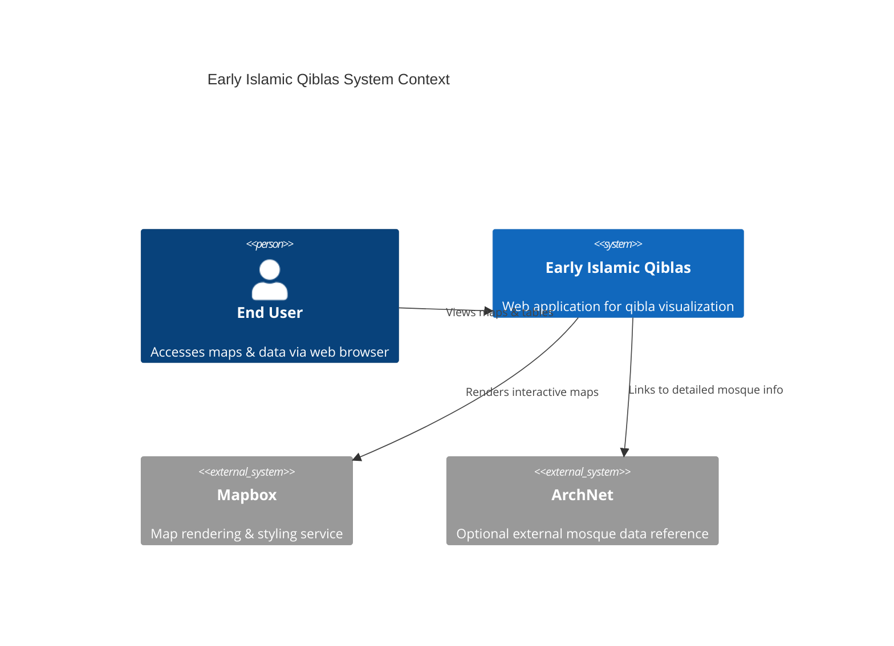
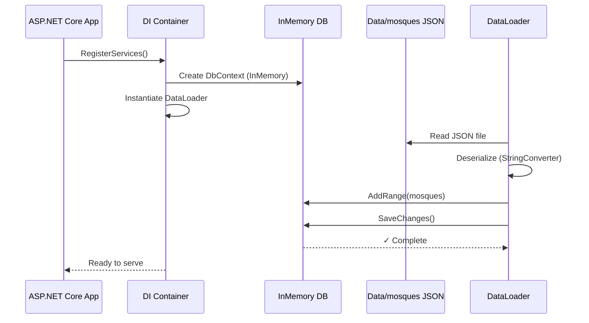
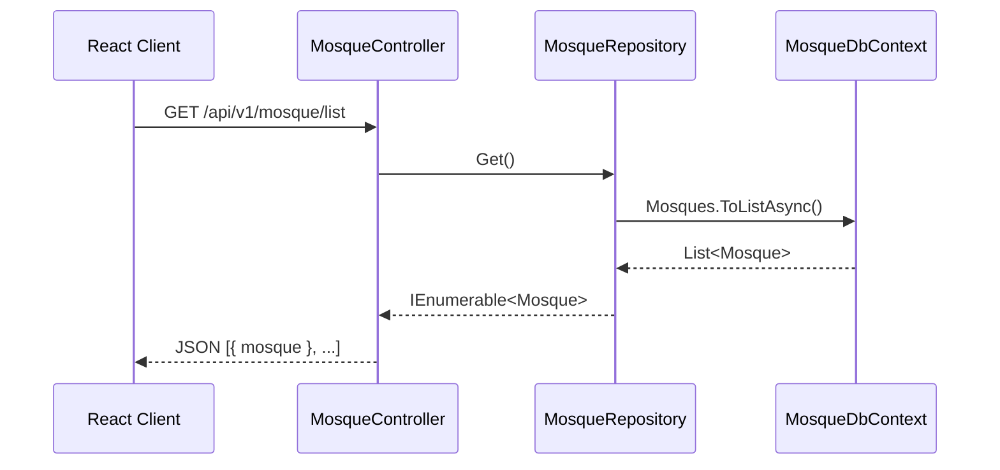
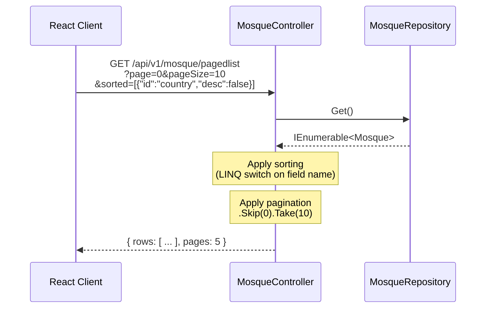
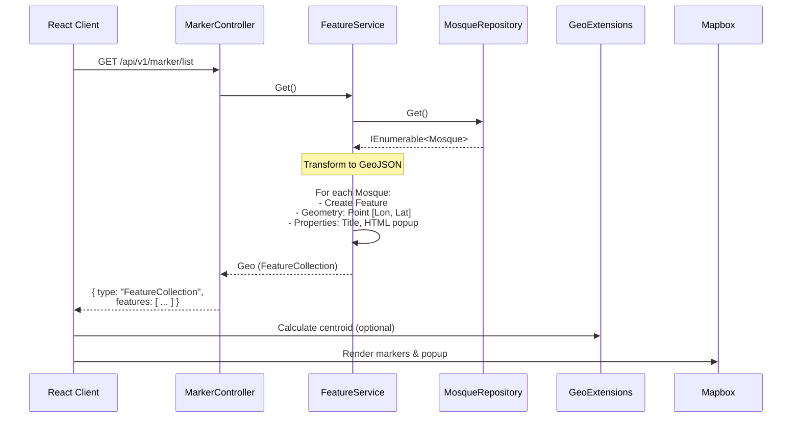

# Technical Analysis: Early Islamic Qiblas

Comprehensive architectural documentation for the Early Islamic Qiblas web application, covering system components, data flows, deployment, and integration points.

## Table of Contents

1. [Architecture Overview](#architecture-overview)
2. [System Components](#system-components)
3. [Data Flow](#data-flow)
4. [API Reference](#api-reference)
5. [Configuration](#configuration)
6. [Deployment & Infrastructure](#deployment--infrastructure)
7. [Extension Points](#extension-points)

---

## Architecture Overview

The Early Islamic Qiblas project is a two-tier application with separated concerns:



### Technology Stack

| Layer | Technology | Version | Purpose |
|-------|-----------|---------|---------|
| **Backend** | ASP.NET Core | net10.0 | REST API, controller routing, CORS |
| **Core Library** | .NET Standard | netstandard2.1 | Framework-agnostic domain & services |
| **Database** | Entity Framework Core | Latest | In-memory data persistence with InMemory provider |
| **Frontend** | React | 16.x | UI rendering, state management |
| **Mapping** | Mapbox GL JS | 2.6.1+ | Interactive map visualization |
| **UI Components** | Bootstrap 4 + Reactstrap | Latest | Responsive layout & components |
| **Data Tables** | React Table | 6.10.0+ | Paginated & sortable data grid |
| **Serialization** | System.Text.Json | Built-in | JSON serialization without external deps |

---

## System Components

### 1. **Backend Architecture**

```mermaid
graph TB
    subgraph Core["EarlyIslamicQiblas.Core (netstandard2.1)"]
        DomainM["📦 Domain Models<br/>Mosque, MapBox, Feature, Geo"]
        Repos["📦 Repository Interface<br/>IMosqueRepository"]
        Services["📦 Services<br/>IFeatureService, FeatureService"]
        Ext["📦 Extensions<br/>GeoExtensions, CustomExtension"]
        Config["📦 Configuration<br/>StringConverter"]
    end
    
    subgraph Web["early-islamic-qiblas (net10.0)"]
        Controllers["🎯 Controllers<br/>MosqueController, MarkerController"]
        Repos2["📦 MosqueRepository<br/>EF Core implementation"]
        DI["🔧 Dependency Injection<br/>NativeInjectorBootStrapper"]
        DB["💾 MosqueDbContext<br/>EF Core InMemory"]
        DataLoad["📥 DataLoader<br/>JSON → DB seeding"]
        Program["▶️ Program.cs<br/>App host & middleware"]
    end
    
    subgraph Frontend["ClientApp (React 16.x)"]
        Components["🎨 React Components<br/>Map, Table, Layout"]
        Store["📊 State Management<br/>React hooks"]
        Mapbox["🗺️ Mapbox Integration<br/>GL JS"]
    end
    
    Repos -.->|implements| Repos2
    Services -.->|uses| Repos
    Controllers -->|consumes| Services
    Controllers -->|consumes| Repos2
    DI -->|configures| Services
    DI -->|configures| Repos2
    DI -->|configures| DB
    DataLoad -->|seeds| DB
    Program -->|bootstraps| DI
    Components -->|calls| Controllers
    Store -->|manages| Components
    Mapbox -->|renders| Components
    Ext -->|supports| Services
    Config -->|converts| DataLoad
```



### 2. **Core Library (netstandard2.1)**

**Purpose:** Framework-agnostic domain logic, data structures, and business operations.

#### Domain Models

**`Mosque`** — Core entity representing a single mosque.

```csharp
public class Mosque
{
    public string? GibsonClassification { get; set; }  // Classification scheme
    public string? YearCE { get; set; }                // Gregorian calendar year
    public string? YearAH { get; set; }                // Islamic calendar year
    public string? AgeGroup { get; set; }              // Historical period (e.g., "Muhammad")
    public string? City { get; set; }
    public string? Country { get; set; }
    public string? MosqueName { get; set; }            // Primary key
    public string? Rebuilt { get; set; }               // Reconstruction information
    public double Lat { get; set; }                    // Latitude
    public double Lon { get; set; }                    // Longitude
    public double? Dir { get; set; }                   // Qibla direction (degrees)
    public string? MoreInfo { get; set; }              // External reference URL
}
```

**`Geo` / `Feature` / `Geometry` / `Properties`** — GeoJSON structures for map rendering.

```csharp
public class Geo
{
    public string? Type { get; set; }                  // "FeatureCollection"
    public List<Feature> Features { get; set; }       // Array of Features
}

public class Feature
{
    public string? Type { get; set; }                  // "Feature"
    public Geometry? Geometry { get; set; }
    public Properties? Properties { get; set; }
}

public class Geometry
{
    public string? Type { get; set; }                  // "Point"
    public List<double> Coordinates { get; set; }    // [longitude, latitude]
}

public class Properties
{
    public string? Title { get; set; }                 // Mosque name
    public string? Description { get; set; }          // HTML popup content
}
```

#### Service Interfaces

**`IFeatureService`** — Converts Mosque entities to GeoJSON for map rendering.

```csharp
public interface IFeatureService
{
    Task<Geo> Get();  // Returns FeatureCollection of all mosques
}
```

**`IMosqueRepository`** — Data access contract (implementation in web project).

```csharp
public interface IMosqueRepository
{
    Task<IEnumerable<Mosque>> Get();           // All mosques
    Task<Mosque> Get(string name);             // Single mosque by name
}
```

#### Extensions

| Extension | Method | Purpose |
|-----------|--------|---------|
| **GeoExtensions** | `ToCartesian()` | Convert WGS84 (lon/lat) → 3D Cartesian coordinates |
| **GeoExtensions** | `ToWGS84()` | Convert 3D Cartesian → WGS84 (lon/lat) |
| **GeoExtensions** | `Centroid()` | Calculate geographic centroid of point cloud |
| **CustomExtension** | `PopUp()` | Generate HTML popup for map markers |
| **CollectionExtension** | `Random()` | Select random item from collection |
| **CollectionExtension** | `DistinctBy()` | Filter distinct items by predicate |

### 3. **Web Project (net10.0)**

#### Controllers

**`MosqueController`** — REST API for mosque data.

| Endpoint | Method | Parameters | Returns | Purpose |
|----------|--------|-----------|---------|---------|
| `/api/v1/mosque/list` | GET | — | `IEnumerable<Mosque>` | All mosques |
| `/api/v1/mosque/pagedlist` | GET | `pageSize`, `page`, `sorted`, `filtered` | `{ rows, pages }` | Paginated + sortable list |
| `/api/v1/mosque/{name}` | GET | `name` (route) | `Mosque` | Single mosque by name |

**Query Parameter Format:**

- `sorted` — JSON string: `[{ "id": "fieldName", "desc": true/false }]`
- `filtered` — JSON string (parsed but not currently used in filtering)
- `pageSize`, `page` — Integers for pagination (0-indexed page)

**`MarkerController`** — REST API for GeoJSON & geographic calculations.

| Endpoint | Method | Parameters | Returns | Purpose |
|----------|--------|-----------|---------|---------|
| `/api/v1/marker/list` | GET | — | `Geo` (GeoJSON FeatureCollection) | All mosques as map markers |
| `/api/v1/marker/centroid` | GET | — | `IEnumerable<double>` | [lon, lat] of geographic centroid |
| `/api/v1/marker/random` | GET | — | `IEnumerable<double>` | [lon, lat] of random mosque |

#### Dependency Injection

**`NativeInjectorBootStrapper.RegisterServices()`** — Configures DI container.

```csharp
// Service registrations
services.AddScoped<IMosqueRepository, MosqueRepository>();
services.AddScoped<IFeatureService, FeatureService>();

// Database setup (InMemory with timestamp-based name)
var dbName = $"Mosque_{DateTime.Now.ToFileTimeUtc()}";
var dbOptions = new DbContextOptionsBuilder<MosqueDbContext>()
    .UseInMemoryDatabase(dbName)
    .Options;
services.AddScoped(ctx => new MosqueDbContext(dbOptions));

// Data seeding
DataLoader seeding = new(dbContext!);  // Loads Data/mosques JSON file
```

#### Entity Framework Core Configuration

**`MosqueDbContext`** — In-memory database context.

```csharp
public DbSet<Mosque> Mosques { get; set; }

protected override void OnModelCreating(ModelBuilder modelBuilder)
{
    modelBuilder.Entity<Mosque>(eb =>
    {
        eb.HasKey(p => new { p.MosqueName });    // Composite key (single property)
        eb.HasIndex(p => new { p.AgeGroup });    // Index for filtering
    });
}
```

**Key Design:**
- Primary key is `MosqueName` (unique identifier)
- Index on `AgeGroup` for filtering by historical period
- No navigation properties (no related entities)

#### Data Seeding

**`DataLoader`** — Populates InMemory database at startup.

```csharp
public DataLoader(MosqueDbContext context)
{
    var fileJson = File.ReadAllText("Data/mosques");
    var serializeOptions = new JsonSerializerOptions
    {
        Converters = new[] { new StringConverter() }  // Handle numeric strings
    };
    
    var mosques = JsonSerializer.Deserialize<IEnumerable<Mosque>>(
        fileJson,
        serializeOptions
    );
    
    context.Mosques.AddRange(mosques);
    context.SaveChanges();
}
```

**Why `StringConverter`?** The JSON file contains numeric values for fields like `YearCE`, but the `Mosque` model expects strings. The converter seamlessly converts numbers → strings during deserialization.

---

## Data Flow

### 1. **Startup & Data Initialization**



### 2. **Mosque List Request (Full Data)**



### 3. **Paginated & Sorted Request**



### 4. **GeoJSON Feature Request (Map Rendering)**



### 5. **Centroid Calculation**


**Formula:** Treats coordinates as 3D vectors on the unit sphere, computes mean, projects back to surface.

---

## API Reference

### Base URL

```
https://{domain}/api/v1/
```

### Authentication

Not implemented — all endpoints are public (CORS enabled for `*`).

### Response Format

All successful responses return HTTP 200 with JSON payload. Errors return appropriate status codes (e.g., 404 for not found).

### Mosque Endpoints

#### `GET /mosque/list`

Retrieve all mosques without pagination.

**Parameters:** None

**Response:**
```json
[
  {
    "gibsonClassification": "Type A",
    "yearCE": "622",
    "yearAH": "1",
    "ageGroup": "Muhammad",
    "city": "Medina",
    "country": "Saudi Arabia",
    "mosqueName": "Quba Mosque",
    "rebuilt": "435 AH",
    "lat": 24.439619,
    "lon": 39.617228,
    "dir": 328,
    "moreInfo": "http://archnet.org/sites/548"
  }
]
```

#### `GET /mosque/pagedlist`

Retrieve paginated, optionally sorted mosque data.

**Parameters:**

| Name | Type | Required | Example |
|------|------|----------|---------|
| `page` | int | Yes | `0` (zero-indexed) |
| `pageSize` | int | Yes | `10` |
| `sorted` | string (JSON) | Yes | `[{"id":"country","desc":false}]` |
| `filtered` | string (JSON) | Yes | `[]` (reserved, not used) |

**Sortable Fields:** `mosqueName`, `country`, `city`, `yearCE`, `gibsonClassification`

**Response:**
```json
{
  "rows": [ /* array of Mosque */ ],
  "pages": 5
}
```

#### `GET /mosque/{name}`

Retrieve a single mosque by name.

**Parameters:**

| Name | Type | In |
|------|------|----|
| `name` | string | Route |

**Response:**
```json
{
  "gibsonClassification": "Type A",
  "yearCE": "622",
  /* ... mosque fields ... */
}
```

**Status:** 200 if found, default serialization (nulls included) if not found.

### Marker Endpoints

#### `GET /marker/list`

Retrieve all mosques as GeoJSON FeatureCollection for map rendering.

**Parameters:** None

**Response:**
```json
{
  "type": "FeatureCollection",
  "features": [
    {
      "type": "Feature",
      "geometry": {
        "type": "Point",
        "coordinates": [39.617228, 24.439619]
      },
      "properties": {
        "title": "Quba Mosque",
        "description": "<h3>Quba Mosque</h3>City: Medina<br/>..."
      }
    }
  ]
}
```

#### `GET /marker/centroid`

Calculate the geographic centroid of all mosques.

**Parameters:** None

**Response:**
```json
[39.5, 24.4]  // [longitude, latitude]
```

#### `GET /marker/random`

Return coordinates of a random mosque.

**Parameters:** None

**Response:**
```json
[39.617228, 24.439619]  // [longitude, latitude]
```

---

## Configuration

### CORS Configuration

**File:** `NativeInjectorBootStrapper.cs`

```csharp
services.AddCors(options =>
{
    options.AddPolicy("qiblas", o =>
        o.AllowAnyOrigin()
         .AllowAnyHeader()
         .AllowAnyMethod());
});
```

**Current Setting:** All origins allowed (no authentication required).

**For Production:** Restrict to specific domain:
```csharp
o.WithOrigins("https://yourdomain.com")
 .AllowAnyHeader()
 .AllowAnyMethod();
```

### Database Configuration

**In-Memory Database Name:** Generated at runtime using file time UTC:
```csharp
var dbName = $"Mosque_{DateTime.Now.ToFileTimeUtc()}";
```

**Why Timestamp?** Prevents naming collisions if multiple instances start simultaneously.

### SPA Configuration

**File:** `Program.cs`

```csharp
services.AddSpaStaticFiles(configuration =>
{
    configuration.RootPath = "ClientApp/build";
});
```

**Development:** Uses React development server via npm script `start`
**Production:** Serves pre-built static files from `ClientApp/build`

### Frontend Environment Variables

**File:** `ClientApp/.env`

```bash
REACT_APP_MAPBOX_ACCESS_TOKEN=pk_your_token_here
REACT_APP_MAPBOX_STYLE=mapbox://styles/mapbox/streets-v12
```

Required for map functionality. Obtain token from [Mapbox Account Dashboard](https://account.mapbox.com/).

---

## Deployment & Infrastructure

### Development

```bash
# Backend
dotnet restore
dotnet run

# Frontend (in parallel)
cd ClientApp
npm install
npm start
```

**Backend** listens on `https://localhost:5001` (ASP.NET Core)  
**Frontend** listens on `http://localhost:3000` (React dev server)  
CORS allows cross-origin calls from React to backend.

### Production Build

```bash
# Build React bundle
cd ClientApp
npm run build

# (From root) Run ASP.NET Core, which serves ClientApp/build
dotnet run --configuration Release
```

**Single URL:** App is served as SPA from ASP.NET Core; no separate frontend server needed.

### Docker Deployment (Recommended)

**Dockerfile for multi-stage build:**

```dockerfile
# Stage 1: Build frontend
FROM node:18-alpine AS frontend-build
WORKDIR /app/ClientApp
COPY ClientApp .
RUN npm install && npm run build

# Stage 2: Build backend
FROM mcr.microsoft.com/dotnet/sdk:10 AS backend-build
WORKDIR /app
COPY . .
RUN dotnet publish -c Release -o /app/publish

# Stage 3: Runtime
FROM mcr.microsoft.com/dotnet/aspnet:10
WORKDIR /app
COPY --from=backend-build /app/publish .
COPY --from=frontend-build /app/ClientApp/build ./ClientApp/build
COPY Data ./Data
EXPOSE 8080
ENV ASPNETCORE_URLS=http://+:8080
ENTRYPOINT ["dotnet", "early-islamic-qiblas.dll"]
```

### Environment Variables (Runtime)

| Variable | Purpose | Example |
|----------|---------|---------|
| `ASPNETCORE_URLS` | Listening URL | `http://+:80` |
| `ASPNETCORE_ENVIRONMENT` | Execution mode | `Production` |

---

## Extension Points

### Adding a New API Endpoint

1. **Create controller method** in `MosqueController` or `MarkerController`
2. **Decorate with** `[HttpGet]`, `[HttpPost]`, etc. and `[EnableCors("qiblas")]`
3. **Inject dependencies** via constructor (DI resolves automatically)
4. **Call repository or service** and return result

**Example:**
```csharp
[HttpGet("[action]")]
[EnableCors("qiblas")]
public async Task<IEnumerable<string>> GetCities()
{
    var mosques = await repoMosque.Get();
    return mosques.Select(m => m.City).Distinct().OrderBy(c => c);
}
```

### Adding a New Domain Model

1. **Create POCO in** `EarlyIslamicQiblas.Core/Models/Domain/`
2. **Add property to** `Mosque` class OR create separate entity
3. **Configure EF in** `MosqueDbContext.OnModelCreating()`:
   ```csharp
   modelBuilder.Entity<NewModel>(eb => {
       eb.HasKey(p => p.Id);
       eb.HasIndex(p => p.SomeField);
   });
   ```
4. **Seed data in** `DataLoader` (if loading from JSON)

### Customizing Map Rendering

The `PopUp()` extension method (in `CustomExtension.cs`) generates HTML for map popups:

```csharp
public static string PopUp(this Mosque m)
{
    return new StringBuilder()
        .Append($"<h3>{m.MosqueName}</h3>")
        .Append($"City: {m.City}</br>")
        // ... add more fields
        .ToString();
}
```

Modify this method to change popup appearance across all markers.

### Adding Sorting Capability

In `MosqueController.PagedList()`, add a case to the switch statement:

```csharp
case "ageGroup":
    rows = srt.desc 
        ? rows.OrderByDescending(q => q.AgeGroup)
        : rows.OrderBy(q => q.AgeGroup);
    break;
```

---

## Performance Considerations

### In-Memory Database

**Pros:**
- No external database needed
- Fast queries (all data in RAM)
- Deterministic for testing

**Cons:**
- Entire dataset loaded at startup
- Data lost on app restart
- Not suitable for datasets > ~1 million records

**For Scale:** Replace `UseInMemoryDatabase()` with `UseSqlServer()` or PostgreSQL and implement pagination at the database layer.

### Centroid Calculation

Current implementation recalculates from scratch on every request:
- Load all features
- Convert each coordinate pair
- Sum and divide

**Optimization:** Cache centroid after initial load (negligible for typical datasets).

### CORS Configuration

Current `AllowAnyOrigin()` is suitable for development but should be restricted in production to prevent unauthorized cross-origin calls.

---

## Key Dependencies

| Package | Version | Purpose |
|---------|---------|---------|
| `Microsoft.EntityFrameworkCore.InMemory` | Latest | In-memory database |
| `Microsoft.AspNetCore.SpaServices.Extensions` | Latest | SPA middleware |
| `System.Text.Json` | Built-in | JSON serialization |
| `React` | 16.x | Frontend framework |
| `Mapbox GL JS` | 2.6.1+ | Map rendering |

No external dependencies beyond ASP.NET Core, EF Core, and standard React ecosystem.

